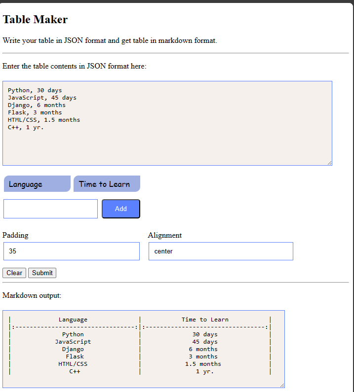

## How to see the code in effect?

You have to launch Python http server from the HOME directory of this repo.

```bash
python -m http.server 8000
```

> Now, visit, http://localhost:8000/browser_ui/index.html .

Hopefully, you'll see the UI screen like this:



> **Note:** After entering text into the input JSON area, switch to another field using 'tab' key.
> There's a button trigger added to parse the plain text into JSON format on tab-key press.

## What are Future plans ?

I am willing to convert this into a **chrome browser extension**. This can be majorly used to create `markdown tables` (and many other features to be added related to markdown from plain text) on the fly and paste them into GitHub or GitLab like websites.
